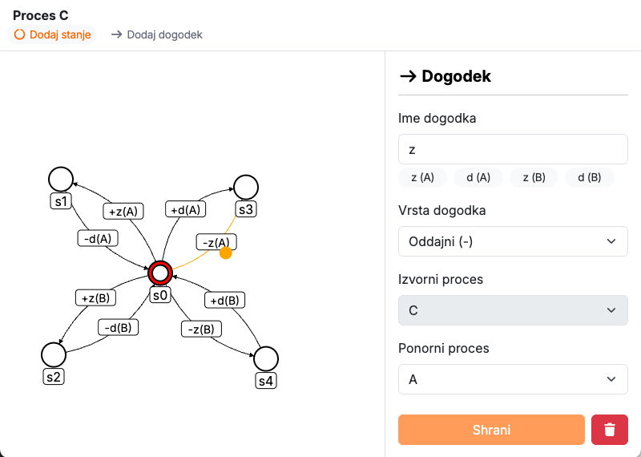
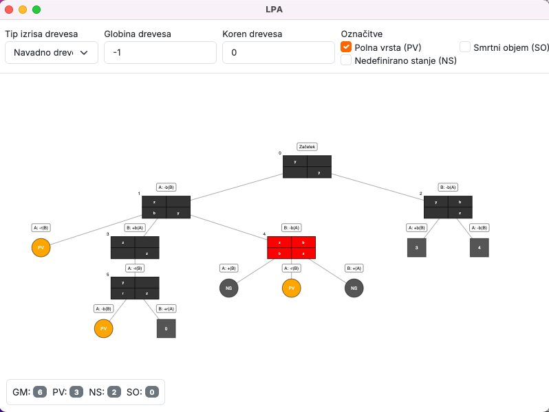

<p align="center">
  
</p>

# Orodje za analizo komunikacijskih protokolov


Namizna aplikacija, razvita v okviru diplomskega dela  
**Razvoj orodja za analizo komunikacijskih protokolov**.

Aplikacija je zgrajena z uporabo ogrodja **Electron** in omogoča formalno
modeliranje ter analizo komunikacijskih protokolov po metodi PGSS.

<p float="center" style="text-align: center">
  
  
</p>

## Prenos

👉 [Prenesi macOS (.dmg)](https://github.com/majdev25/LPA/releases/download/1.0/LPA-1.0.0-arm64.dmg)

Aplikacija ni podpisana z Apple Developer certifikatom.
Ob prvem zagonu je potrebno odstraniti karanteno:

```bash
xattr -rd com.apple.quarantine /Applications/LPA.app
```

## Zahteve

- Node.js (LTS)
- npm

## Namestitev

```bash
npm install
```

## Zagon v razvojnem načinu

```bash
npm run dev
```

Zažene aplikacijo v razvojnem okolju Electron.

## Gradnja aplikacije

```bash
npm run build
```

Zgradi produkcijsko različico aplikacije. Izhodne datoteke se ustvarijo v mapi dist/.

## Opomba

Projekt je bil razvit izključno za raziskovalne in izobraževalne namene
v okviru diplomskega dela.
